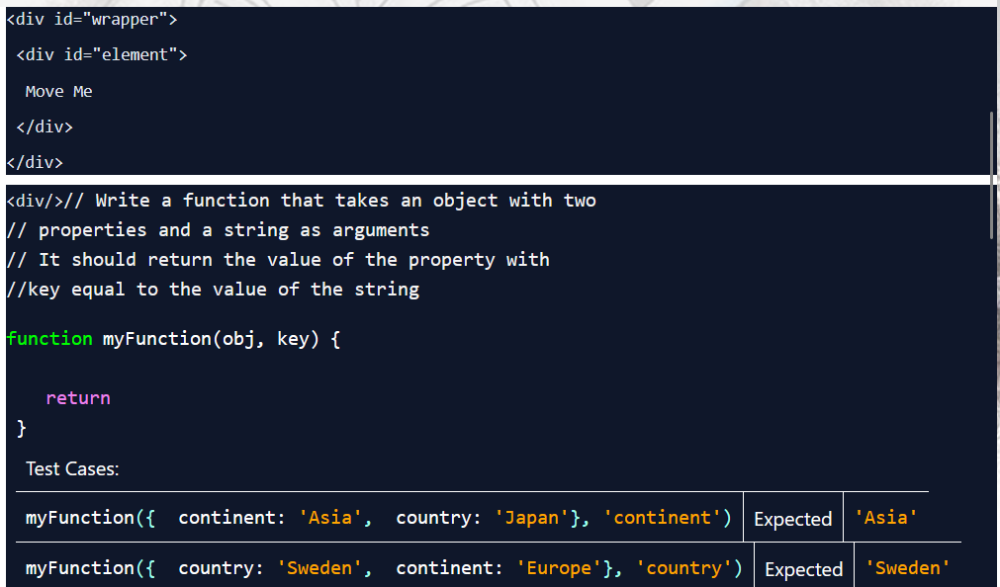
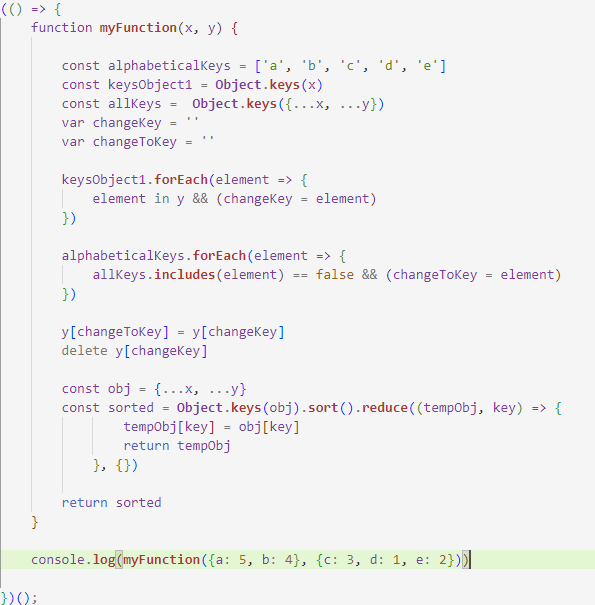
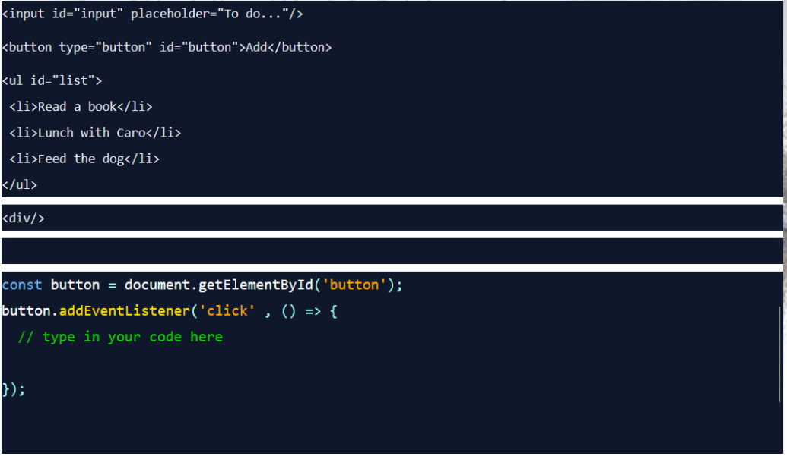

# TechnicalTest Fabulor

### Task: 3 Challenges

### Time: 8 hours (13:30 - 21:30)

## Challenge 1:

### Challenge:

### Solution: 

### Explanation

If the given key exist in the given object, the function returns the value of that key.
If not, it returns that the key is not found within the object.

## Challenge 2:

### Challenge:

### Solution: 

### Explanation

The first const alphabeticalKeys is an array that contains the wanted keys in string form.
The second one is an array that contains the keys of the first object x.
The third one again is an array that contains all the keys in the given objects, as from x as from y.

I declared the two variables first, I could have declared them later when used, but this is easthetically more pleasing.

The first things that happen are two forEach loops:
    - To check if there is a key that is double and should be changed later.
    - To check if there is a key double and which one exactly.

Later the value of the to be changed key is assigned to the new key.
A new object is created which contains the first object x and the updated object y.
And lastly the object is sorted so that the keys are in alphabetical order.

This is the object that is returned.

## Challenge 3:

### Challenge:

### Solution: 

### Explanation

const button is the button in the HTML that was given.
const list is the list in the same HTML.

When the button is clicked, the const valueToAdd is set to the value of the input field in the HTML.
Then a new 'li'-HTML element is created and the text node of this element is set to the value of valueToAdd.

And lastly the listItem or 'li'-HTML element is added to the list in the HTML.

This code could be 4 lines shorter due to the unnecessary declarations of the constants and variables
but I choose again for the easthetically more pleasing option.